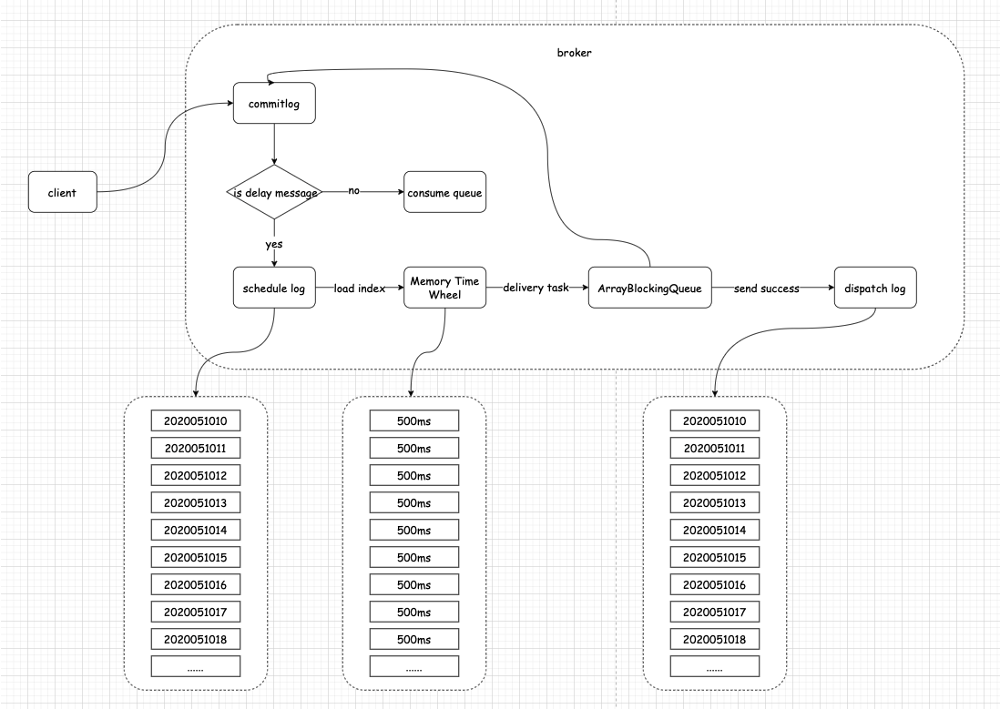

# RocketMq支持任意延迟的延时消息方案

<a name="2Piv3"></a>
### 主要特性
支持任意延迟的延时消息，精确到秒，最长延迟时间为1年。

<a name="4RnXI"></a>
### 使用方法
<a name="oz0hb"></a>
#### 配置broker.conf
```
segmentScale=60  ##每个时间桶的时间范围，单位分钟，默认60，可选值0-60之间，延迟消息并发数越高，配置的值应该越小，如：10
dispatchLogKeepTime=72 ##dispatchLog过期后保存的小时数，默认72
```
<a name="hkrpC"></a>
#### 
<a name="vmcMt"></a>
#### producer
```
	DefaultMQProducer producer = new DefaultMQProducer("please_rename_unique_group_name");

        producer.setNamesrvAddr("127.0.0.1:9876");

        producer.start();

        for (int i = 0; i < 100000; i++) {
            try {

                Message msg = new Message("TopicTest" /* Topic */,
                    "TagA" /* Tag */,
                    ("Hello RocketMQ " + i).getBytes(RemotingHelper.DEFAULT_CHARSET) /* Message body */
                );

		/*
                 * 设置延迟时间，单位：秒
                 */
                msg.setDelayTime(5);
                
                SendResult sendResult = producer.send(msg);

                System.out.printf("%s%n", sendResult);
            } catch (Exception e) {
                e.printStackTrace();
                Thread.sleep(1000);
            }
        }

        producer.shutdown();


```

<a name="iJfkl"></a>
#### consumer
和普通 consumer相同

<a name="MikPs"></a>
### 设计思路
延时消息设计思路主要来自于去哪儿网的qmq，使用两层hash wheel来实现。第一层位于磁盘上，默认每个小时为一个刻度，可以根据实际情况在配置里进行调整(segmentScale)。每个刻度会生成一个日志文件(schedulelog)，支持一年内的延迟消息，因此最多会生成8784个文件。第二层在内存中，当消息的投递时间即将到来的时候，会将这个小时的消息索引(索引包括消息在schedulelog中的offset和size)从磁盘文件加载到内存中的hash wheel上，内存中的hash wheel则是以500ms为一个刻度。之所以存索引而不存消息本身是因为当消息并发量很大时把1小时的消息放到内存消耗太大不可接受，所以当投递时间到达时，需要根据消息索引再去schedulelog中回查出消息本身，再投递。<br />

### 整体架构



<a name="Qbp4e"></a>
#### 主要文件
**schedulelog**：按照投递时间组织，文件名就是投递的时间区间（如2020020213）。写schedulelog的入口是在DefaultMessageStore的dispatcher链中新增了一环，当发现是延迟消息时，会修改原始消息的topic为“DELAY_TOPIC_XXXX”，且跳过consumequeue文件，直接写schedulelog。schedulelog里是包含完整的消息内容的，所以commitlog过期被删除也不影响延迟消息的投递。当延迟时间到达时再重新修改topic，投递到原本的commitlog和consumequeue。


**dispatchlog**：在延时消息投递成功后写入，主要用于在应用重启后能够确定哪些消息已经投递，dispatchlog里写入的是消息在schedulelog的offset，不包含消息内容。其用途是当延时server中途重启时，我们需要判断出当前这个刻度(比如一个小时)里的消息有哪些已经投递了则不重复投递，没投递的则扔进内存的hash wheel准备投递。


**schedule_offset_checkpoint**：在broker正常退出时写入，主要记录每个schedulelog文件的当前写入位置wrotePosition和已写入的最新消息在commitlog中的位移maxCommitLogOffset。前者主要用于broker重启后快速校验schedulelog文件的完整性。后者是由于rocketmq broker重启后的消息重放任务ReputService会重放大量已投递过的消息，因此写schedulelog前必须做去重，去重方式就是如果收到的消息的commitlog offest小于等于maxCommitLogOffset，则表明是重复消息，无需再写。


<a name="QhglS"></a>
### 主要修改点

<a name="Cr51e"></a>
#### MessageStoreConfig
扩展了broker.conf配置文件，新增了延迟消息相关配置

<a name="Lxniu"></a>
#### DefaultMessageStore
新增CommitLogDispatcherBuildDelayLog用于转发延迟消息保存任务。

<a name="Oq9js"></a>
#### org.apache.rocketmq.store
新增delay目录，提供delay log的存储和消费进度保存等功能。


